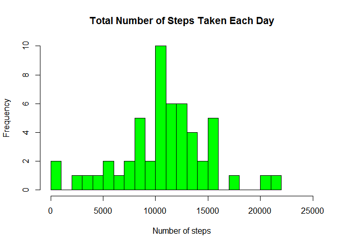
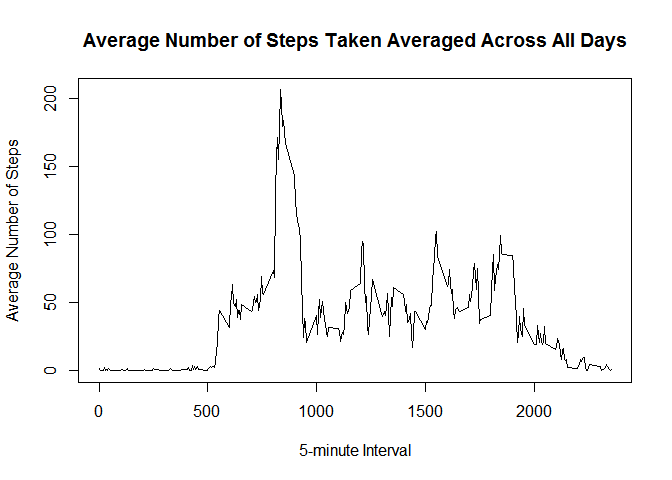
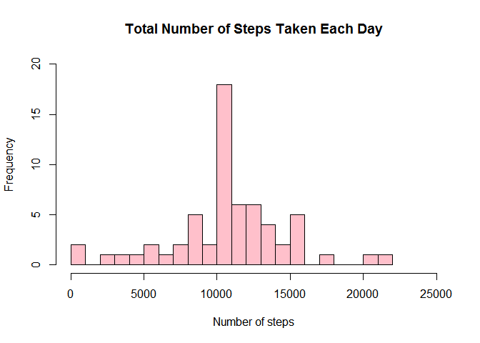

#Reproducible Research - Peer Assessment 1


###Load the data for Processing.


```r
data <- read.table("C:/DataScience course/Course 5 - Reproducible research/Project 1/activity.csv", header=T,sep=",")
```


##What is mean total number of steps taken per day?


- Calculate total number of steps taken every day.


```r
Total_Step <- aggregate(steps~date,data=data,sum, na.rm=TRUE)
```


- Make a histogram of the total number of steps taken each day.


```r
hist(Total_Step$steps,xlab="Number of steps",col="green",main="Total Number of Steps Taken Each Day",breaks=25,xlim=c(0,25000))
```

 


- Calculate and report the mean and median of the total number of steps taken per day.


```r
mean(Total_Step$steps)
```

```
## [1] 10766.19
```

```r
median(Total_Step$steps)
```

```
## [1] 10765
```

###Result/Outcome

mean of total number of steps taken per day = 10766.19

median of total number of steps taken per day = 10765
    
    

## What is the average daily activity pattern?

- Make a time series plot (i.e. type = "l") of the 5-minute interval (x-axis) and the average number of steps taken, averaged across all days (y-axis)


```r
Avg_Step <-aggregate(steps~interval,data=data,mean, na.rm=TRUE)

plot(Avg_Step$interval,Avg_Step$steps,type="l",main="Average Number of Steps Taken Averaged Across All Days",xlab="5-minute Interval",ylab="Average Number of Steps")
```

 


- Which 5-minute interval, on average across all the days in the dataset, contains the maximum number of steps?


```r
Avg_Step$interval[which.max(Avg_Step[,2] )]
```

```
## [1] 835
```

```r
Avg_Step$steps[which.max(Avg_Step[,2] )]
```

```
## [1] 206.1698
```

###Result/Outcome

The 835th, 5-minute interval, on average across all the days, contains the maximum number of the 206 steps.


##Imputing missing values.

- Calculate and report the total number of missing values in the dataset (i.e. the total number of rows with NAs)


```r
Missing_Value<-sum(!complete.cases(data))
Missing_Value
```

```
## [1] 2304
```


- Devise a strategy for filling in all of the missing values in the dataset. The strategy does not need to be sophisticated.


```r
Impute <- data.frame(data$steps)
Impute[is.na(Impute),] <- tapply(X=data$steps,INDEX=data$interval,FUN=mean,na.rm=TRUE)
```


- Create a new dataset that is equal to the original dataset but with the missing data filled in.


```r
New_Data <- cbind(Impute,data[c(2,3)])
colnames(New_Data)<-c(names(data))
```


- Agggregate new dataset.


```r
Total_New_Step <- aggregate(steps~date,data=New_Data,sum)
```


- Make a histogram of the total number of steps taken each day.


```r
hist(Total_New_Step$steps,xlab="Number of steps",col="pink",main="Total Number of Steps Taken Each Day",breaks=25,xlim=c(0,25000),ylim=c(0,20))
```

 


- Calculate and report the mean and median total number of steps taken per day. 


```r
mean(Total_New_Step$steps)
```

```
## [1] 10766.19
```

```r
median(Total_New_Step$steps)
```

```
## [1] 10766.19
```

###Result/Outcome after Imputation

mean of total number of steps taken per day = 10766.19

median of total number of steps taken per day = 10766.19


- Do these values differ from the estimates from the first part of the assignment? What is the impact of imputing missing data on the estimates of the total daily number of steps?


```r
mean(Total_New_Step$steps)-mean(Total_Step$steps)
```

```
## [1] 0
```

```r
median(Total_New_Step$steps)-median(Total_Step$steps)
```

```
## [1] 1.188679
```

###Result/Outcome after Imputation

The missing values are imputed/replaced with Mean in new dataset. Therfore mean value do not changed after imputation and Median value increased slightly and new median is equals to Mean.


##Are there differences in activity patterns between weekdays and weekends?

For this part the weekdays() function may be of some help here. Use the dataset with the filled-in missing values for this part.


- Create a new factor variable in the dataset with two levels - "weekday" and "weekend" indicating whether a given date is a weekday or weekend day.


```r
New_Data$date <- as.Date(New_Data$date, "%Y-%m-%d")
New_Data$day <-weekdays(New_Data$date)
New_Data$day[New_Data$day%in%c("Monday","Tuesday","Wednesday","Thursday","Friday")]<-c("Weekday")
New_Data$day[New_Data$day%in%c("Saturday","Sunday")]<-c("Weekend")
New_Data$day<-as.factor(New_Data$day)
```

- Make a panel plot containing a time series plot (i.e. type = "l") of the 5-minute interval (x-axis) and the average number of steps taken, averaged across all weekday days or weekend days (y-axis). 


```r
Avg_Steps_Interval<- aggregate(steps ~ interval + day, New_Data, mean)
library(lattice)
xyplot(Avg_Steps_Interval$steps~ Avg_Steps_Interval$interval|Avg_Steps_Interval$day, main="Average Steps per Day by Interval",xlab="Interval", ylab="Steps",layout=c(1,2), type="l")
```

 


###Result/Outcome after Imputation

From the review of two plots, we can clearly see that the distribution throughout the day is quite different. The intensity of acitivies inceases later during the weekends. The huge amount of steps taken on weekdays, between 500 to 1000 interval, which does not appear on Saturdays or Sundays. Generally, the whole weekend seems to be more evenly distributed with no huge deviations.We can observe on average more steps during a weekend day, than on a "working" day. 
